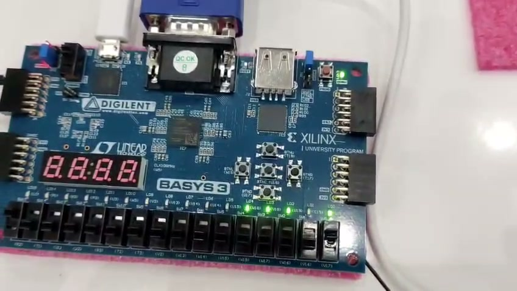

# Tutorial — Gravação na Basys 3 (NRZ-I)

Este tutorial mostra o fluxo completo de **síntese → implementação →
geração do *bitstream* → gravação na placa Basys 3**, partindo do projeto
Vivado já pronto. O *top* sintetizado é o `Top_Module`, que integra o
módulo `NRZ_I` à placa (divisor de clock, controle `start/reset`, saída
em LEDs, PMOD JA e VGA).

## 1. Pré-requisitos

- AMD Vivado 2025.2 instalado, com suporte à família Artix-7.
- Placa **Digilent Basys 3** (FPGA `xc7a35tcpg236-1`).
- Cabo **micro-USB** para alimentação e programação da placa.
- Drivers Digilent (Adept) instalados.
- Projeto `nrz_i/vivado_project/NRZ_I.xpr` aberto, com `Top_Module`
  definido como *top* da síntese.

> Para a saída VGA, o projeto depende do IP **`clk_wiz_vga`**
> (Clocking Wizard) já gerado no projeto Vivado, com *Reset* e *Locked*
> removidos e *Requested Frequency* de **25,175 MHz**. Ele deve aparecer
> em `Sources` → `IP Sources` e estar marcado como **OOC Synthesized**.

## 2. Definir `Top_Module` como *top* de síntese

1. No painel **Sources** → **Design Sources**, clicar com o botão direito
   em `Top_Module` → **Set as Top**.
2. Verificar que o `NRZ_I` aparece como sub-instância (`meu_nrzi_inst`)
   sob o `Top_Module`.

## 3. Síntese

1. No **Flow Navigator**, clicar em **Run Synthesis**.
2. Aguardar a conclusão e escolher **Cancel** na janela final para
   avançar à implementação.

## 4. Implementação

1. No **Flow Navigator**, clicar em **Run Implementation**.
2. Aguardar e escolher **Cancel** na janela final.

## 5. Geração do *bitstream*

1. No **Flow Navigator**, clicar em **Generate Bitstream**.
2. Ao final, na janela de diálogo, escolher **Open Hardware Manager**.

## 6. Conexão da placa e *Program Device*

1. Conectar o cabo micro-USB do PC à porta **PROG/USB** da Basys 3.
2. Ligar a placa pelo *switch* `POWER`.
3. Em **Hardware Manager**, clicar em **Open Target** → **Auto Connect**.
4. Clicar com o botão direito em `xc7a35t_0` → **Program Device** →
   selecionar o `.bit` gerado em `NRZ_I.runs/impl_1/Top_Module.bit` →
   **Program**.

## 7. Mapeamento de uso na placa

Conferido em `constraints/basys3_constraints.xdc` (idêntico ao do projeto
NRZ-L; o que muda é a lógica interna do módulo).

| Função                          | Recurso físico             | Pinos                                |
| ------------------------------- | -------------------------- | ------------------------------------ |
| Clock principal (100 MHz)       | Oscilador interno          | `W5`                                 |
| Reset                           | Botão central (`BTNC`)     | `U18`                                |
| Start                           | Botão direito (`BTNR`)     | `T17`                                |
| Entrada de dados `data_in[15:0]`| 16 *switches* SW0–SW15     | `V17, V16, W16, W17, W15, V15, W14, W13, V2, T3, T2, R3, W2, U1, T1, R2` |
| Saída `nrz_out`                 | LED 0 (LD0)                | `U16`                                |
| Índice `bit_idx[3:0]`           | LEDs LD1–LD4               | `E19, U19, V19, W18`                 |
| Saída PMOD `pmod_ja[3:0]`       | PMOD JA, pinos JA1–JA4     | `J1, L2, J2, G2`                     |
| Sincronismo VGA                 | Conector VGA               | `vga_hsync = P19, vga_vsync = R19`   |
| Cores VGA (4 bits cada)         | Conector VGA               | `vga_red[3:0] = G19,H19,J19,N19`; `vga_green[3:0] = J17,H17,G17,D17`; `vga_blue[3:0] = N18,L18,K18,J18` |

Detalhes importantes do `Top_Module` (idênticos ao do NRZ-L):

- O `clk_slow` ≈ 10 Hz é produzido por um contador interno (até
  4 999 999). Com `CYCLES_PER_BIT = 10`, cada bit fica visível por
  aproximadamente **1 segundo** nos LEDs.
- `clk_gated = clk_slow AND ligado`; a transmissão só ocorre depois de
  o usuário pressionar `start`. `reset` zera `ligado`.

## 8. Como testar

1. Posicionar os 16 *switches* na sequência de teste padrão
   `1010110010011101` (MSB → LSB).
2. Pressionar **Reset** (botão central) — `nrz_out` vai a `'0'`
   enquanto `reset = '1'` (linha
   `nrz_out <= '0' when reset = '1' else encoded(bit_index);`).
3. Pressionar **Start** (botão direito).
4. Observar:
   - **LD0** acompanha o sinal **NRZ-I**: transita em cada bit `1` da
     entrada e mantém o nível em cada bit `0`.
   - **LD1–LD4** mostram, em binário, o índice corrente (mesmo
     mapeamento do NRZ-L: `bit_idx[0]` → LD1 … `bit_idx[3]` → LD4).
   - Exemplos de leitura no LD1–LD4:

     | bit_idx | LD4 | LD3 | LD2 | LD1 |
     | :----:  | :-: | :-: | :-: | :-: |
     | 15 (`1111`) | aceso | aceso | aceso | aceso |
     | 10 (`1010`) | aceso | apagado | aceso | apagado |
     | 5  (`0101`) | apagado | aceso | apagado | aceso |
     | 0  (`0000`) | apagado | apagado | apagado | apagado |
5. Para a sequência de teste, a evolução esperada no LD0 (NRZ-I) é
   `1 1 0 0 1 0 0 0 1 1 1 0 0 1 0 1` (MSB → LSB, conforme tabela do
   tutorial de simulação).
6. Alterar a sequência nos *switches* a qualquer momento: o sinal
   modulado responde imediatamente porque a pré-codificação XOR é
   combinacional sobre o vetor `data_in`.

## 9. Extras

- [Saída no PMOD para o Analog Discovery 3](../extras/pmod_osciloscopio/docs/tutorial_pmod.md)
- [Saída VGA com cores pulsantes](../extras/vga/docs/tutorial_vga.md)

## Próximo passo

Concluída a gravação na placa, seguir para o
[Relatório técnico final](../../relatorio_final/relatorio.pdf).
