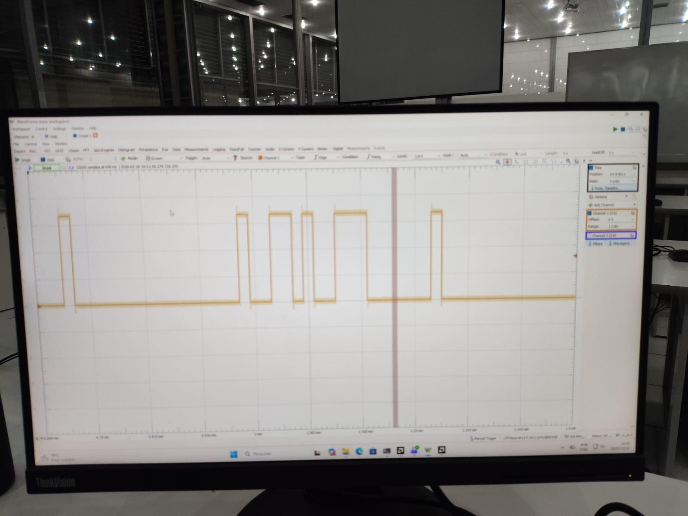

# Tutorial — Captura no PMOD com Analog Discovery 3 (NRZ-I)

Este tutorial mostra como observar o sinal NRZ-I modulado na Basys 3
usando a **Digilent Analog Discovery 3** (AD3) como osciloscópio e o
software **Digilent WaveForms**. O procedimento é o mesmo do NRZ-L; as
diferenças estão apenas no sinal observado.

## 1. Pré-requisitos

- Basys 3 gravada com o *bitstream* do projeto **NRZ-I** (ver
  [tutorial de gravação na placa](../../../docs/tutorial_placa.md)).
- AD3 conectada ao PC por USB.
- WaveForms 3.x ou superior aberto, com a AD3 reconhecida.
- Cabo de pontas (*flywires* MTE) ou *header* PMOD.

## 2. Conexão física

1. Localizar o conector **PMOD JA** na Basys 3.
2. Conectar os fios do AD3 conforme a tabela:

   | Canal AD3 | Cor padrão (flywires) | Pino PMOD JA | Sinal medido           |
   | :-------: | --------------------- | :----------: | ---------------------- |
   | 1+        | Laranja com branco    | JA1          | `nrz_signal` (NRZ-I)   |
   | 2+        | Azul com branco       | JA2          | `clk_gated`            |
   | DIO 0     | Verde (digital)       | JA3          | `start`                |
   | DIO 1     | Verde (digital)       | JA4          | `ligado`               |
   | GND       | Preto                 | GND PMOD JA  | Terra comum            |

   > Os sinais da Basys 3 são **3,3 V LVCMOS** — seguros para o AD3 sem
   > atenuador.

## 3. Configurar o WaveForms

1. Abrir o instrumento **Scope**.
2. **Time/div = 200 ms/div** (visualiza ≈ 2 s).
3. **Channel 1**: escala **1 V/div**, *offset* `0 V`. Mesma config para
   **Channel 2**.
4. Ativar a barra **Logic** para acompanhar `DIO 0` (start) e `DIO 1`
   (ligado).
5. **Trigger**:
   - Source: `Channel 1` (ou `DIO 0` para disparar pelo *start*);
   - Condition: `Rising`;
   - Level: `1,65 V`;
   - Mode: `Normal`.

## 4. Captura

1. Pressionar **Reset** na Basys 3 — `ligado` cai para 0; `nrz_signal`
   vai a `'0'` (forçado pelo gate `nrz_out <= '0' when reset = '1'`).
2. Clicar em **Run** no WaveForms.
3. Pressionar **Start** na Basys 3.
4. Observar:
   - `Channel 1` (NRZ-I) reflete a regra de transição: transita em cada
     bit `1` da entrada, mantém o nível em cada bit `0`.
   - `Channel 2` (`clk_gated`) bate em ≈ 10 Hz.
   - `DIO 0` (`start`) pulsa na partida.
   - `DIO 1` (`ligado`) sobe e permanece em `1`.
5. Exportar a tela com **File → Export → Image**.

## 5. Resultado esperado

Para a sequência `1010110010011101` aplicada à entrada do `NRZ_I`, o
canal 1 reproduz a sequência codificada `1100100011100101` em
segundos a partir do *start*:

| Bit entrada | Ação NRZ-I        | Intervalo (s)   | Nível NRZ-I |
| :---------: | ----------------- | --------------: | :---------: |
| 1           | inverte (0 → 1)   | 0,0 – 1,0       | alto        |
| 0           | mantém            | 1,0 – 2,0       | alto        |
| 1           | inverte (1 → 0)   | 2,0 – 3,0       | baixo       |
| 0           | mantém            | 3,0 – 4,0       | baixo       |
| 1           | inverte (0 → 1)   | 4,0 – 5,0       | alto        |
| 1           | inverte (1 → 0)   | 5,0 – 6,0       | baixo       |
| 0           | mantém            | 6,0 – 7,0       | baixo       |
| 0           | mantém            | 7,0 – 8,0       | baixo       |
| 1           | inverte (0 → 1)   | 8,0 – 9,0       | alto        |
| 0           | mantém            | 9,0 – 10,0      | alto        |
| 0           | mantém            | 10,0 – 11,0     | alto        |
| 1           | inverte (1 → 0)   | 11,0 – 12,0     | baixo       |
| 1           | inverte (0 → 1)   | 12,0 – 13,0     | alto        |
| 1           | inverte (1 → 0)   | 13,0 – 14,0     | baixo       |
| 0           | mantém            | 14,0 – 15,0     | baixo       |
| 1           | inverte (0 → 1)   | 15,0 – 16,0     | alto        |

Comportamento característico observável no canal 1:

- **Pares de `0` consecutivos** (`bit_idx 9-8` e `6-5`) seguram o nível
  por 2 s.
- **Pares de `1` consecutivos** (`bit_idx 11-10` e `3-2`) viram dois
  patamares alternados de 1 s cada.

