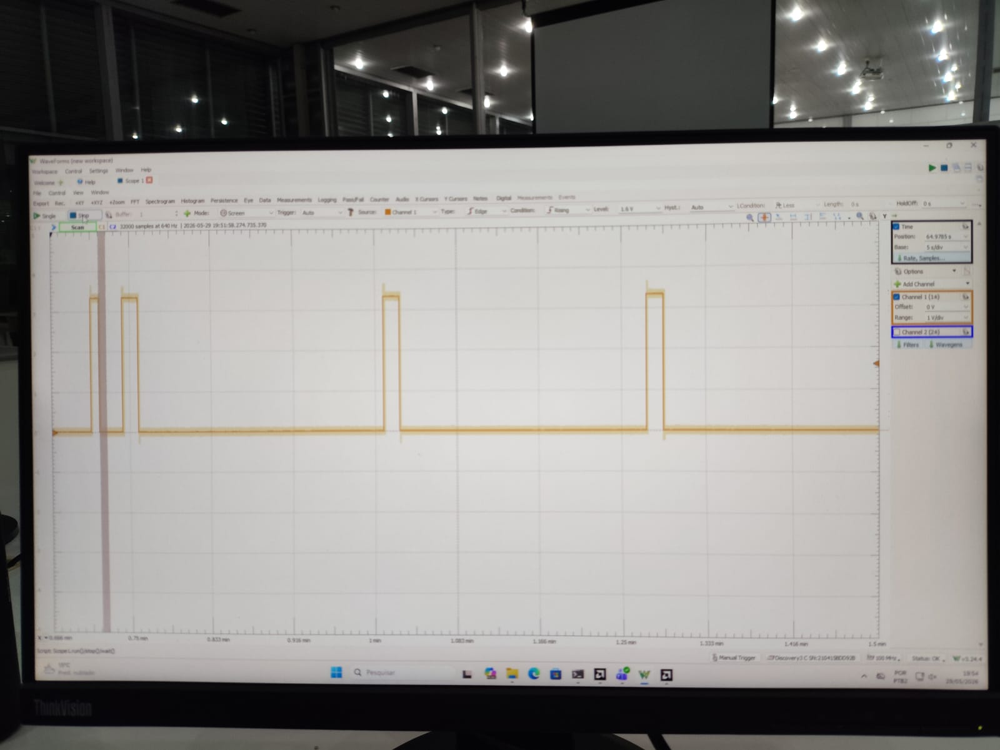

# Tutorial — Captura no PMOD com Analog Discovery 3 (NRZ-L)

Este tutorial mostra como observar o sinal NRZ-L modulado na Basys 3
usando a **Digilent Analog Discovery 3** (AD3) como osciloscópio e o
software **Digilent WaveForms**.

## 1. Pré-requisitos

- Basys 3 já gravada com o *bitstream* do projeto NRZ-L (ver
  [tutorial de gravação na placa](../../../docs/tutorial_placa.md)).
- AD3 conectada ao PC por USB com cabo Type-C.
- WaveForms 3.x ou superior aberto, com a AD3 reconhecida em
  `Settings` → `Device Manager`.
- Cabo de pontas (*flywires* MTE) ou *header* PMOD compatível.

## 2. Conexão física

1. Localizar o conector **PMOD JA** na Basys 3 (canto superior, fileira
   próxima ao botão de power). A pinagem do conector é:

   ```
       JA1  JA2  JA3  JA4  GND  VCC
        |    |    |    |    |    |
        J1   L2   J2   G2  GND  3V3
   ```

2. Conectar os fios do AD3 conforme a tabela:

   | Canal AD3 | Cor padrão (flywires) | Pino PMOD JA | Sinal medido           |
   | :-------: | --------------------- | :----------: | ---------------------- |
   | 1+        | Laranja com branco    | JA1          | `nrz_signal` (NRZ-L)   |
   | 2+        | Azul com branco       | JA2          | `clk_gated`            |
   | DIO 0     | Verde (digital)       | JA3          | `start`                |
   | DIO 1     | Verde (digital)       | JA4          | `ligado`               |
   | GND       | Preto                 | GND PMOD JA  | Terra comum            |

   > Como os sinais da Basys 3 são **3,3 V LVCMOS**, é seguro usar
   > entradas analógicas ou digitais do AD3 sem atenuador.


## 3. Configurar o WaveForms

1. Abrir o instrumento **Scope** (`Welcome` → `Scope`).
2. Configurar **Time/div = 200 ms/div** (visualiza ≈ 2 s, suficiente
   para 1 a 2 bits).
3. Configurar **Channel 1**: escala **1 V/div**, *offset* `0 V`. Mesma
   configuração para o **Channel 2**.
4. Ativar a barra de **Logic** (digital) para acompanhar `DIO 0`
   (start) e `DIO 1` (ligado).
5. Configurar **Trigger**:
   - Source: `Channel 1` (ou `DIO 0` para disparar pelo *start*);
   - Condition: `Rising`;
   - Level: `1,65 V`;
   - Mode: `Normal`.


## 4. Captura

1. Pressionar **Reset** na Basys 3 (botão central) — o canal `ligado`
   deve cair para 0.
2. Clicar em **Run** no WaveForms.
3. Pressionar **Start** na Basys 3 (botão direito).
4. Observar:
   - `Channel 1` (NRZ-L) sustenta cada bit por ≈ 1 segundo, reproduzindo
     a sequência `1010110010011101` configurada nos *switches*.
   - `Channel 2` (`clk_gated`) bate em ≈ 10 Hz.
   - `DIO 0` (`start`) mostra um pulso curto na partida.
   - `DIO 1` (`ligado`) sobe e permanece em `1` enquanto a transmissão
     está ativa.
5. Capturar a tela com **File → Export → Image**.



## 5. Resultado esperado

Para a sequência `1010110010011101` (MSB → LSB), o canal 1 apresenta a
forma de onda direta: 1 s em alto para cada bit `1`, 1 s em baixo para
cada bit `0`. Após o 16º bit, o `bit_idx` volta a 15 e a sequência se
repete enquanto `ligado = '1'`.

Sequência esperada no canal 1, em segundos a partir do *start*:

| Bit | Intervalo (s)   | Nível |
| :-: | --------------: | :---: |
| 1   | 0,0 – 1,0       | alto  |
| 0   | 1,0 – 2,0       | baixo |
| 1   | 2,0 – 3,0       | alto  |
| 0   | 3,0 – 4,0       | baixo |
| 1   | 4,0 – 5,0       | alto  |
| 1   | 5,0 – 6,0       | alto  |
| 0   | 6,0 – 7,0       | baixo |
| 0   | 7,0 – 8,0       | baixo |
| 1   | 8,0 – 9,0       | alto  |
| 0   | 9,0 – 10,0      | baixo |
| 0   | 10,0 – 11,0     | baixo |
| 1   | 11,0 – 12,0     | alto  |
| 1   | 12,0 – 13,0     | alto  |
| 1   | 13,0 – 14,0     | alto  |
| 0   | 14,0 – 15,0     | baixo |
| 1   | 15,0 – 16,0     | alto  |


