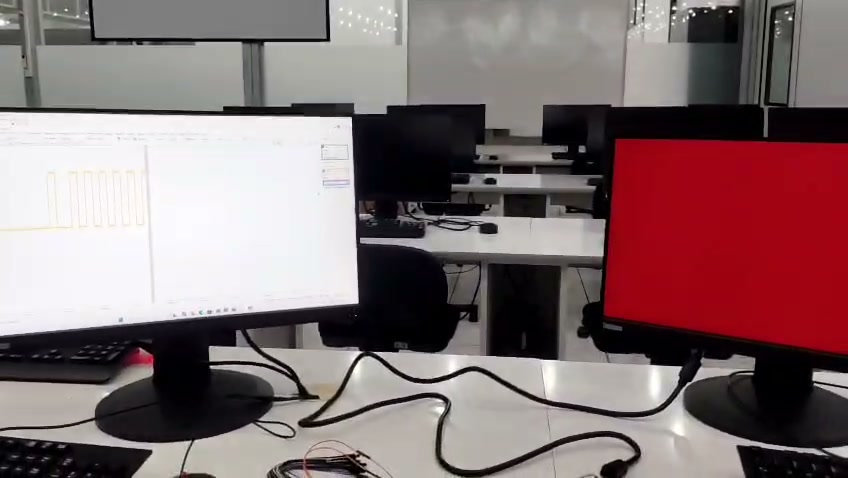

# Extra — Saída VGA com cores pulsantes (NRZ-L)

Utiliza a saída VGA da Basys 3 para apresentar visualmente o pulso
modulado: a **tela inteira muda de cor** conforme o nível corrente do
sinal — **vermelho** quando `nrz_signal = '1'` e **azul** quando
`nrz_signal = '0'`. O resultado é uma "tela pulsante" sincronizada com a
sequência transmitida.

## O que este extra implementa e por quê

O controlador é um VGA padrão **640×480 @ 60 Hz** integrado ao
`Top_Module`, com clock de pixel gerado por um **IP Clocking Wizard**
(`clk_wiz_vga`) configurado para a frequência VESA oficial de
**25,175 MHz**. A cor é constante em toda a área visível e depende
apenas do bit modulado em curso, o que torna a sequência visível à
distância e ajuda na demonstração ao vivo do trabalho.

A frequência de pixel de **25,175 MHz** foi adotada porque a frequência
nominal de **25 MHz** apresentou falha de reconhecimento no monitor
físico (1920×1080); o uso do Clocking Wizard libera o valor exato
exigido pela especificação VESA.

## Estrutura desta pasta

```
vga/
|-- README.md                       Este arquivo
|-- src/                            (sem fontes adicionais — VGA integrado
|                                    em src/Top_Module.vhd do projeto NRZ-L)
|-- constraints/                    (sem constraints adicionais — VGA mapeado
|                                    em constraints/basys3_constraints.xdc)
`-- docs/
    |-- tutorial_vga.md             Passo a passo: configurar o Clocking Wizard,
    |                               conectar o monitor e validar a tela pulsante
    `-- midia/                      Fotos da tela VGA durante a transmissão
```

> Os fontes e constraints do controlador VGA já estão integrados ao
> projeto NRZ-L principal (`src/Top_Module.vhd` e
> `constraints/basys3_constraints.xdc`).

## Equipamentos necessários

- Placa **Digilent Basys 3** gravada com o *bitstream* do NRZ-L
  (`Top_Module` como *top*).
- **Monitor** com entrada VGA (ou adaptador VGA → HDMI/DisplayPort que
  aceite 640×480 @ 60 Hz).
- **Cabo VGA macho-macho**.

## Mapeamento VGA na Basys 3

| Sinal             | Pinos                                                  |
| ----------------- | ------------------------------------------------------ |
| `vga_hsync`       | `P19`                                                  |
| `vga_vsync`       | `R19`                                                  |
| `vga_red[3:0]`    | `G19, H19, J19, N19`                                   |
| `vga_green[3:0]`  | `J17, H17, G17, D17`                                   |
| `vga_blue[3:0]`   | `N18, L18, K18, J18`                                   |

## Como reproduzir

Seguir o [tutorial detalhado](./docs/tutorial_vga.md), que descreve:

1. Verificação do IP `clk_wiz_vga` no projeto Vivado (Requested
   Frequency 25,175 MHz, *Reset* e *Locked* removidos);
2. Geração do *bitstream* e gravação na Basys 3;
3. Conexão do monitor VGA;
4. Operação na placa (`reset` → `start`) e leitura da tela pulsante.



## Próximo passo

Ver o passo a passo completo em [docs/tutorial_vga.md](./docs/tutorial_vga.md).
