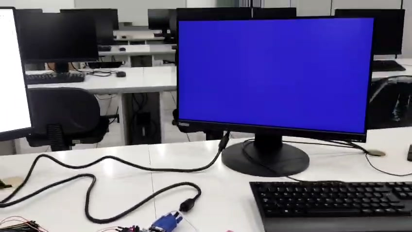

# Tutorial — Saída VGA com cores pulsantes (NRZ-L)

Este tutorial mostra como gerar e validar a saída VGA da Basys 3 com a
tela inteira mudando de cor conforme o sinal `nrz_signal`.

## 1. Pré-requisitos

- AMD Vivado 2025.2.
- Placa **Digilent Basys 3**.
- **Monitor com entrada VGA** (ou adaptador compatível com 640×480 @
  60 Hz).
- Cabo VGA macho-macho.
- Projeto NRZ-L (`nrz_l/vivado_project/NRZ_L.xpr`) aberto, com
  `Top_Module` como *top*.

## 2. IP Clocking Wizard (`clk_wiz_vga`)

O controlador VGA exige uma frequência de pixel próxima de 25 MHz. O
projeto utiliza o **Clocking Wizard** (IP Catalog do Vivado),
instanciado no `Top_Module` como `clk_wiz_vga`. A configuração adotada
é:

1. Abrir o **IP Catalog** (`Window` → `IP Catalog`).
2. Procurar por **Clocking Wizard** e clicar duas vezes.
3. Na aba **Clocking Options**:
   - *Primitive*: `Auto` (o Vivado escolhe MMCM ou PLL).
   - *Primary Input Clock*: 100 MHz (clock da placa).
4. Na aba **Output Clocks**:
   - *clk_out1* → **Requested Output Freq: 25,175 MHz**.
5. Na aba **Optional Inputs / Outputs**:
   - **Remover** as portas **`Reset`** e **`Locked`** (desmarcar).
6. Em **Source Options** confirmar a nomenclatura — o componente
   resultante deve se chamar **`clk_wiz_vga`** (nome usado pelo
   `Top_Module.vhd` em `entity work.clk_wiz_vga`).
7. Clicar em **OK** → **Generate**.

A frequência **25,175 MHz** é a oficial VESA para 640×480 @ 60 Hz. O
valor "redondo" de 25 MHz pode não ser reconhecido por monitores
modernos (como o de teste, com resolução nativa 1920×1080); o uso do
Clocking Wizard libera o valor correto da especificação.

> Caso o projeto Vivado já contenha o IP `clk_wiz_vga` gerado, esta
> etapa de configuração não precisa ser repetida — basta abrir o
> projeto.

## 3. Síntese, implementação e bitstream

Seguir o [tutorial de gravação na placa](../../../docs/tutorial_placa.md)
do projeto NRZ-L: **Run Synthesis** → **Run Implementation** →
**Generate Bitstream** → **Program Device**.

## 4. Conexão do monitor

1. Desligar a Basys 3 antes da conexão.
2. Conectar o cabo VGA do monitor ao conector VGA da Basys 3 (DB-15
   na borda inferior da placa).
3. Ligar o monitor e a placa.

## 5. Operação

1. Posicionar os 16 *switches* na sequência de teste
   `1010110010011101` (mesma ordem dos demais tutoriais).
2. Pressionar **Reset** (botão central) — a tela passa a exibir a cor
   correspondente a `nrz_signal = '0'` (azul) enquanto `ligado = '0'`.
3. Pressionar **Start** (botão direito) — a tela começa a alternar
   conforme a sequência:

   | `nrz_signal` | Cor de tela cheia |
   | :----------: | :---------------: |
   | `'1'`        | **Vermelho** (R=`1111`, G=`0`, B=`0`) |
   | `'0'`        | **Azul** (R=`0`, G=`0`, B=`1111`)     |
4. Cada cor permanece por ≈ 1 segundo (intervalo de um bit), formando
   uma "tela pulsante" sincronizada com a transmissão.

## 6. Solução de problemas

- **Tela "Sem sinal" / *Out of range***: verificar a frequência do IP
  (25,175 MHz) e os pinos VGA no `.xdc`. Alguns monitores rejeitam
  640×480 @ 60 Hz em adaptadores ativos VGA → HDMI.
- **Imagem tremida**: confirmar que o gerador de clock está com
  *Optional Ports* `Reset`/`Locked` removidas (a entrada `Reset` aberta
  fica indefinida e pode flutuar).
- **Cor errada**: rever o bloco `process(video_on, nrz_signal)` do
  `Top_Module.vhd`. Os comentários internos do fonte podem dizer
  "verde/preto", mas o comportamento real implementado é
  **vermelho/azul** (ver a documentação técnica).

## 7. Observação sobre os comentários no fonte

O `Top_Module.vhd` do projeto NRZ-L contém comentários antigos
("Tela Verde" / "Tela Preta") junto ao bloco de cores. O comportamento
sintetizado e observado na placa é **vermelho para nível alto** e
**azul para nível baixo**, conforme as atribuições reais de
`vga_red`, `vga_green` e `vga_blue` no processo.
