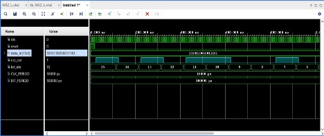
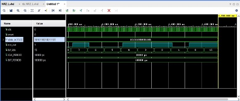
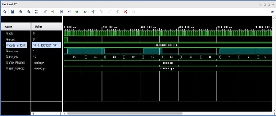
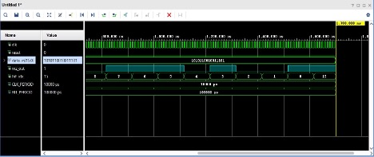

# Modulação Digital em VHDL (Vivado) — NRZ-L e NRZ-I

**Relatório Técnico — Entrega N2 (2º bimestre)**

Faculdade de Engenharia Salvador Arena — Engenharia de Computação
Disciplina: Comunicação de Dados — Sistemas Reconfiguráveis
Professor: Vinícius S. Borges
Semestre: 2026/1
Local e ano: São Bernardo do Campo — SP, 2026

**Integrantes**

| Nome                                | RA          |
| ----------------------------------- | ----------- |
| Matheus Mitsuo Sato Silva           | 081230046   |
| Nicolas Gomes Lima                  | 081230048   |
| Júlio César Caberlino Ferro         | 081230003   |
| Alex Saifi de Souza                 | 081230025   |
| Felipe Medeiros                     | 081230026   |

---

## Resumo

Foram implementados, simulados e gravados em FPGA dois moduladores
digitais Unipolares — **NRZ-L** e **NRZ-I** — utilizando VHDL e a
ferramenta AMD Vivado 2025.2 sobre a placa Digilent Basys 3
(Artix-7 `xc7a35tcpg236-1`). A simulação comportamental no Vivado
Simulator validou ambos os moduladores com a sequência
`"1010110010011101"` (hex `AC9D`), e a implementação física empregou
os 16 *switches* da placa como entrada, o LED 0 como saída principal,
os LEDs LD1–LD4 como índice binário do bit corrente, o conector PMOD JA
para visualização no Digilent Analog Discovery 3 (WaveForms) e a saída
VGA 640×480 @ 60 Hz para apresentação de cores pulsantes
(vermelho/azul). A análise comparativa confirmou as propriedades
teóricas de cada modulação: NRZ-L como codificação direta, sem
memória, e NRZ-I como codificação por transição, com memória de
estado.

## 1. Introdução

A codificação digital banda base é o estágio elementar de qualquer
sistema de comunicação digital: dada uma sequência de bits, define-se a
forma de onda que representa cada bit no meio físico. Entre os esquemas
mais simples estão as variantes **Non-Return-to-Zero** (NRZ), nas quais
o sinal permanece em um nível constante durante todo o intervalo de
bit, sem voltar a um nível de repouso entre símbolos.

Este trabalho tratou de duas variantes Unipolares: **NRZ-L** (*Level*),
em que o nível do pulso representa diretamente o bit, e **NRZ-I**
(*Inverted*), em que o bit é representado pela transição (ou ausência
de transição) do nível no início do intervalo. As duas modulações
foram desenvolvidas como projetos Vivado independentes e validadas em
simulação comportamental e em execução na placa Basys 3, conforme o
enunciado da entrega N2.

Objetivos específicos:

- Implementar em VHDL os moduladores NRZ-L e NRZ-I com a mesma
  parametrização (largura do vetor e duração do bit em ciclos de
  clock).
- Validar o comportamento de cada modulador por simulação
  comportamental no Vivado Simulator, sobre a mesma sequência de bits.
- Executar a modulação na Basys 3, com entrada via *switches* e saída
  visual via LEDs.
- Realizar as duas atividades extras: saída pelo PMOD para osciloscópio
  (Analog Discovery 3) e saída VGA com cores pulsantes.
- Comparar quantitativa e qualitativamente as duas modulações sobre a
  mesma entrada.

## 2. Fundamentação Teórica

### 2.1 Modulação Unipolar NRZ-L

Na NRZ-L, o nível do pulso durante todo o intervalo de bit representa o
próprio bit: o bit `1` corresponde a nível alto e o bit `0` a nível
baixo. Trata-se de codificação direta — a saída no instante atual
depende exclusivamente do bit atual, sem memória de estado. O receptor
recupera os bits amostrando o nível do sinal nos instantes corretos.

### 2.2 Modulação Unipolar NRZ-I

Na NRZ-I, o que codifica o bit é a **transição** no início do intervalo
de bit. O bit `1` inverte o nível em relação ao bit anterior; o bit `0`
mantém o nível. Diferente da NRZ-L, a saída depende do nível
imediatamente anterior — é necessária memória de estado na
implementação, seja por meio de um registrador ou de uma pré-codificação
combinacional equivalente.

### 2.3 Quadro comparativo

| Característica            | NRZ-L                             | NRZ-I                                      |
| ------------------------- | --------------------------------- | ------------------------------------------ |
| Regra de codificação      | Bit 1 → alto; Bit 0 → baixo       | Bit 1 → inverte nível; Bit 0 → mantém      |
| Memória de estado         | Não                                | Sim                                         |
| Decodificação             | Sensível à polaridade do canal    | Imune à inversão de polaridade              |
| Sincronização             | Ruim em sequências longas de zeros | Ruim em sequências longas de zeros         |

## 3. Metodologia

O trabalho foi conduzido segundo um fluxo encadeado:

1. **Estudo** do enunciado, do material teórico e da pinagem da
   Basys 3.
2. **Implementação em VHDL** dos moduladores `NRZ_L` e `NRZ_I` como
   módulos parametrizados por `DATA_WIDTH` (16) e `CYCLES_PER_BIT` (10),
   acompanhados de testbenches (`tb_NRZ_L.vhd` e `tb_nrz_I.vhd`).
3. **Simulação comportamental** no Vivado Simulator, com
   `xsim.simulate.runtime = 2000 ns`, aplicando a sequência fixa de
   teste `"1010110010011101"` (hex `AC9D`) a ambos os projetos.
4. **Síntese, implementação e geração de *bitstream*** para a
   Basys 3, tendo como *top* sintetizado o `Top_Module.vhd`, que
   integra o módulo de modulação à placa.
5. **Gravação na FPGA** via *Hardware Manager* e validação física com
   *switches*, botões e LEDs.
6. **Atividades extras** — saída no PMOD JA observada no Analog
   Discovery 3 com o software WaveForms; e saída VGA com cor de tela
   cheia controlada pelo sinal modulado, com clock de pixel gerado por
   um IP Clocking Wizard configurado em 25,175 MHz.

Ferramentas e plataformas utilizadas:

- AMD Vivado 2025.2.
- Placa Digilent Basys 3 (Artix-7 `xc7a35tcpg236-1`).
- Digilent Analog Discovery 3 + Digilent WaveForms.
- Monitor com entrada VGA.

Parâmetros fixos adotados em todos os documentos e simulações:

| Parâmetro       | Valor                | Descrição                                                                   |
| --------------- | -------------------- | --------------------------------------------------------------------------- |
| `DATA_WIDTH`    | 16                   | Largura do vetor de entrada (alinhado às 16 chaves da Basys 3).             |
| `CLK_PERIOD`    | 10 ns                | Período do clock principal (100 MHz, oscilador da placa).                   |
| `BIT_PERIOD`    | 100 ns               | Duração de cada bit no testbench.                                            |
| `CYCLES_PER_BIT`| 10                   | Ciclos de clock por bit (`BIT_PERIOD / CLK_PERIOD`).                         |
| `data_in`       | `"1010110010011101"` | Sequência de teste (hex `AC9D`), MSB → LSB.                                  |
| `reset`         | Síncrono, ativo alto | Inicializa contadores e o estado da varredura.                               |

## 4. Desenvolvimento

### 4.1 Estrutura comum

Ambos os projetos foram construídos em torno de dois níveis hierárquicos:

- O **módulo de modulação** (`NRZ_L.vhd` / `NRZ_I.vhd`), com a mesma
  interface (`clk`, `reset`, `data_in[15:0]`, `nrz_out`, `bit_idx`) e
  os mesmos *generics* (`DATA_WIDTH = 16`, `CYCLES_PER_BIT = 10`). O
  módulo varre o vetor `data_in` do MSB ao LSB; um contador interno
  conta `CYCLES_PER_BIT` ciclos de `clk` antes de avançar para o
  próximo bit.
- O **wrapper de placa** (`Top_Module.vhd`), responsável pela
  integração com a Basys 3. O `Top_Module` recebe o clock de 100 MHz da
  placa, gera um *clock lento* (≈ 10 Hz) por meio de um contador,
  fornece a FSM `start/ligado` que trava o início da transmissão pelo
  botão direito, instancia o módulo de modulação com um *gated clock*
  (`clk_gated = clk_slow AND ligado`) e replica o sinal modulado em
  três saídas: LED 0, PMOD JA e cor de tela cheia VGA. O controlador
  VGA é o padrão 640×480 @ 60 Hz, com clock de pixel produzido pelo IP
  `clk_wiz_vga` (Clocking Wizard) configurado em 25,175 MHz.

### 4.2 Implementação do NRZ-L

O módulo `NRZ_L` é puramente sequencial. Um único `process(clk)`
síncrono pela borda de subida cuida da varredura e do registro do bit
corrente em um *flip-flop* `current_bit`, que é exposto na saída
`nrz_out`. A regra de saída é direta: `current_bit <= data_in(bit_index)`.

### 4.3 Implementação do NRZ-I

O módulo `NRZ_I` adota **pré-codificação combinacional por cascata de
XOR** declarada com `generate`:

```vhdl
encoded(DATA_WIDTH-1) <= '0' XOR data_in(DATA_WIDTH-1);

gen_encode: for i in DATA_WIDTH-2 downto 0 generate
    encoded(i) <= encoded(i+1) XOR data_in(i);
end generate;
```

A cada posição, o bit codificado é o XOR entre o bit codificado da
posição anterior (do MSB em direção ao LSB) e o bit de entrada. O
processo síncrono é idêntico ao do NRZ-L, exceto que a saída é
`encoded(bit_index)`, com um gate adicional que força `nrz_out = '0'`
durante o reset. A abordagem combinacional é equivalente ao uso de um
*flip-flop* explícito para o nível anterior e responde imediatamente a
alterações nos *switches*.

### 4.4 Decisões de projeto

- **Varredura MSB → LSB**: foi adotada por facilitar a leitura do
  índice nos LEDs LD1–LD4 e a interpretação direta dos *switches*
  (SW15 como MSB).
- **`CYCLES_PER_BIT` como *generic***: separa a duração do bit do
  período do clock. Permitiu ajustar o ritmo para a simulação (rápido)
  e para a placa (lento, visualmente perceptível) sem alterar a
  lógica.
- **Divisor de clock para ≈ 10 Hz e *gating***: a frequência efetiva de
  bit na placa é `clk_slow / CYCLES_PER_BIT ≈ 1 bit/s`, escolha que
  manteve cada bit visível por aproximadamente um segundo nos LEDs.
  O *gating* por `ligado` impede transmissão involuntária ao ligar a
  placa.
- **Pré-codificação por XOR (NRZ-I)**: alternativa à abordagem com
  registrador. É equivalente, evita reentrância e é mais robusta na
  simulação comportamental.
- **Clocking Wizard a 25,175 MHz**: necessário porque a frequência
  nominal "redonda" de 25 MHz apresentou falha de reconhecimento no
  monitor físico (resolução nativa 1920×1080); a frequência VESA oficial
  para 640×480 @ 60 Hz é 25,175 MHz, e o uso do IP libera o valor
  exato. As portas `Reset` e `Locked` foram removidas da interface do
  IP por simplicidade.

### 4.5 Implementação na placa

Conforme o `basys3_constraints.xdc`, o mapeamento de uso na placa
adotado é:

| Função                          | Recurso físico            | Pinos                                |
| ------------------------------- | ------------------------- | ------------------------------------ |
| Clock principal (100 MHz)       | Oscilador interno         | `W5`                                 |
| Reset                           | Botão central (`BTNC`)    | `U18`                                |
| Start                           | Botão direito (`BTNR`)    | `T17`                                |
| Entrada `data_in[15:0]`         | 16 *switches* SW0–SW15    | `V17, V16, W16, W17, W15, V15, W14, W13, V2, T3, T2, R3, W2, U1, T1, R2` |
| Saída `nrz_out`                 | LED 0 (LD0)               | `U16`                                |
| Índice `bit_idx[3:0]`           | LEDs LD1–LD4              | `E19, U19, V19, W18`                 |
| Saída PMOD `pmod_ja[3:0]`       | PMOD JA, JA1–JA4          | `J1, L2, J2, G2`                     |
| Sincronismo VGA                 | Conector VGA              | `vga_hsync = P19, vga_vsync = R19`   |
| Cores VGA (4 bits cada)         | Conector VGA              | `vga_red[3:0] = G19,H19,J19,N19`;<br>`vga_green[3:0] = J17,H17,G17,D17`;<br>`vga_blue[3:0] = N18,L18,K18,J18` |

A correspondência **`bit_idx[0]` → LD1 … `bit_idx[3]` → LD4** segue a
ordem do `.xdc`. Em operação:

- O botão central (reset) zera a FSM `ligado`; o LED 0 vai a `'0'`.
- O botão direito (start) inicia a transmissão.
- O LED 0 exibe o sinal modulado; os LEDs LD1–LD4 mostram, em binário,
  o índice corrente do bit, varrendo de `1111` (15) a `0000` (0).
- A sequência de entrada pode ser alterada nos *switches* a qualquer
  momento, sem regravação.

## 5. Resultados

### 5.1 Simulação — NRZ-L

A simulação cobriu o reset e os 16 bits da sequência de teste, com tempo
de simulação ajustado em 2000 ns. A saída `nrz_out` reproduziu o vetor
de entrada bit a bit, sustentando cada bit por 100 ns. Em 1620 ns o
`bit_idx` retornou a 15 e a sequência se repetiu, conforme programado
pela varredura cíclica.

| bit_idx | Bit | Intervalo (ns) | `nrz_out` |
| ------: | :-: | -------------: | :-------: |
| 15      | 1   | 20–120         | alto      |
| 14      | 0   | 120–220        | baixo     |
| 13      | 1   | 220–320        | alto      |
| 12      | 0   | 320–420        | baixo     |
| 11      | 1   | 420–520        | alto      |
| 10      | 1   | 520–620        | alto      |
| 9       | 0   | 620–720        | baixo     |
| 8       | 0   | 720–820        | baixo     |
| 7       | 1   | 820–920        | alto      |
| 6       | 0   | 920–1020       | baixo     |
| 5       | 0   | 1020–1120      | baixo     |
| 4       | 1   | 1120–1220      | alto      |
| 3       | 1   | 1220–1320      | alto      |
| 2       | 1   | 1320–1420      | alto      |
| 1       | 0   | 1420–1520      | baixo     |
| 0       | 1   | 1520–1620      | alto      |



*Figura 1 — NRZ-L: forma de onda de 0 a 1000 ns. Bits MSB visíveis, de
`bit_idx` 15 até `bit_idx` 5.*



*Figura 2 — NRZ-L: forma de onda de 800 a 1700 ns. Bits restantes
(`bit_idx` 8 até 0) e loop em 1620 ns.*

### 5.2 Simulação — NRZ-I

A mesma configuração do NRZ-L foi aplicada ao NRZ-I, com a mesma
sequência de entrada para comparação direta. A pré-codificação por XOR
produziu a sequência codificada na saída
**`1100100011100101`** (MSB → LSB):

| bit_idx | Bit | Ação NRZ-I        | Nível resultante |
| ------: | :-: | ----------------- | :--------------: |
| 15      | 1   | inverte (0 → 1)   | alto             |
| 14      | 0   | mantém            | alto             |
| 13      | 1   | inverte (1 → 0)   | baixo            |
| 12      | 0   | mantém            | baixo            |
| 11      | 1   | inverte (0 → 1)   | alto             |
| 10      | 1   | inverte (1 → 0)   | baixo            |
| 9       | 0   | mantém            | baixo            |
| 8       | 0   | mantém            | baixo            |
| 7       | 1   | inverte (0 → 1)   | alto             |
| 6       | 0   | mantém            | alto             |
| 5       | 0   | mantém            | alto             |
| 4       | 1   | inverte (1 → 0)   | baixo            |
| 3       | 1   | inverte (0 → 1)   | alto             |
| 2       | 1   | inverte (1 → 0)   | baixo            |
| 1       | 0   | mantém            | baixo            |
| 0       | 1   | inverte (0 → 1)   | alto             |



*Figura 3 — NRZ-I: forma de onda de 0 a 1000 ns. Transição inicial em
`bit_idx` 15 e nível mantido em `bit_idx` 14 (bit 0).*



*Figura 4 — NRZ-I: forma de onda de 800 a 1700 ns. Transições e
patamares conforme a pré-codificação XOR.*

### 5.3 Execução na placa Basys 3

Após gravação do *bitstream*, a placa foi operada com os *switches*
configurados na sequência de teste. Pressionado o botão central
(reset), as saídas voltaram ao estado inicial; pressionado o botão
direito (start), a transmissão evoluiu com cada bit visível por
aproximadamente um segundo. Os LEDs LD1–LD4 exibiram o índice em
binário (de `1111` a `0000`), e o LED 0 acompanhou o sinal modulado.


*Figura 5 — Basys 3 durante a transmissão NRZ-L. LD0 reproduz o nível
do bit corrente; LD1–LD4 indicam o índice em binário.*


*Figura 6 — Basys 3 durante a transmissão NRZ-I. O LD0 alterna apenas
quando há bit 1 na entrada.*

### 5.4 Extra — Captura no Analog Discovery 3 (PMOD JA)

O sinal modulado, o *clock* lento e os pulsos de *start* e *ligado*
foram observados no software WaveForms com a Digilent Analog Discovery 3
conectada ao PMOD JA da Basys 3. O canal 1 (JA1) acompanhou
diretamente o sinal NRZ; o canal 2 (JA2) recebeu o *clock gated*; as
linhas digitais DIO0 e DIO1 capturaram, respectivamente, o pulso de
start e o estado da FSM `ligado`.


*Figura 7 — Captura no WaveForms do sinal NRZ-L sobre os 16 bits da
sequência de teste. Time/div = 200 ms.*


*Figura 8 — Captura no WaveForms do sinal NRZ-I. Observam-se os
patamares longos em sequências de bit 0 e as transições rápidas em
sequências de bit 1.*

### 5.5 Extra — Saída VGA com cores pulsantes

A saída VGA da Basys 3 foi conectada a um monitor com adaptador
compatível. O controlador 640×480 @ 60 Hz, com clock de pixel de
25,175 MHz fornecido pelo IP `clk_wiz_vga`, gerou tela cheia em
**vermelho** quando `nrz_signal = '1'` e em **azul** quando
`nrz_signal = '0'`. Durante a transmissão da sequência de teste, a
tela alternou as cores em sincronia com cada bit ativo no LED 0,
formando uma demonstração visual eficaz.


*Figura 9 — Tela VGA em vermelho (nível alto) durante a transmissão.*


*Figura 10 — Tela VGA em azul (nível baixo) durante a transmissão.*

## 6. Análise e Discussão

### 6.1 NRZ-L

A forma de onda observada na simulação e na placa confirma a
correspondência direta entre cada bit do vetor de entrada e o nível do
sinal de saída. Para a sequência `"1010110010011101"`, o `nrz_out`
reproduz a sequência exatamente como entrada: 100 ns em alto para cada
bit `1` na simulação (≈ 1 s na placa) e 100 ns em baixo para cada bit
`0`. Em 1620 ns o índice volta a 15 e o ciclo se repete. Na placa, a
visualização em tempo real nos LEDs permitiu acompanhar bit a bit a
sequência configurada nos *switches*.

### 6.2 NRZ-I

A forma de onda da NRZ-I confirma a regra de codificação por
transição. Os pares de `0` consecutivos (`bit_idx 9-8` e `6-5`)
mantêm o nível por 200 ns (≈ 2 s na placa). Os pares de `1`
consecutivos (`bit_idx 11-10` e `3-2`) viram dois patamares alternados
de 100 ns cada (≈ 1 s na placa cada). Em todos os pontos a saída
seguiu a regra `1 → inverte / 0 → mantém`, com o nível inicial `'0'`
assumido pelo primeiro XOR da cascata.

### 6.3 Comparação direta NRZ-L × NRZ-I

Aplicando a mesma sequência aos dois moduladores, observa-se a
diferença prática entre as duas codificações:

| Posição (`bit_idx`) | Bit de entrada | NRZ-L  | NRZ-I  | Diferença? |
| :-----------------: | :------------: | :----: | :----: | :--------: |
| 15                  | 1              | alto   | alto   | —          |
| 14                  | 0              | baixo  | alto   | Sim        |
| 13                  | 1              | alto   | baixo  | Sim        |
| 12                  | 0              | baixo  | baixo  | —          |
| 11                  | 1              | alto   | alto   | —          |
| 10                  | 1              | alto   | baixo  | Sim        |
| 9                   | 0              | baixo  | baixo  | —          |
| 8                   | 0              | baixo  | baixo  | —          |
| 7                   | 1              | alto   | alto   | —          |
| 6                   | 0              | baixo  | alto   | Sim        |
| 5                   | 0              | baixo  | alto   | Sim        |
| 4                   | 1              | alto   | baixo  | Sim        |
| 3                   | 1              | alto   | alto   | —          |
| 2                   | 1              | alto   | baixo  | Sim        |
| 1                   | 0              | baixo  | baixo  | —          |
| 0                   | 1              | alto   | alto   | —          |

Em 7 dos 16 bits os níveis diferem. Mesmo com a mesma entrada, as
formas de onda são visualmente distintas: o NRZ-I segura o nível em
sequências de zeros (blocos largos) e gera transições rápidas em
sequências de uns.

### 6.4 Simulação versus execução na placa

Os perfis observados nas duas vias foram coerentes, escalonados pelo
fator de tempo entre simulação (BIT_PERIOD = 100 ns) e placa
(BIT_PERIOD ≈ 1 s, devido ao divisor de clock para ≈ 10 Hz).
Diferenças relevantes ficaram restritas a:

- A captura no WaveForms exibiu o sinal real do PMOD JA, com bordas
  bem definidas em 3,3 V LVCMOS — sem indícios de ruído ou *jitter*
  visível no instrumento utilizado.
- A saída VGA, embora seja apenas uma representação visual do sinal,
  exigiu cuidado especial com a frequência de pixel: a opção pelo IP
  Clocking Wizard a 25,175 MHz resolveu o problema inicial de não
  reconhecimento pelo monitor.

### 6.5 Interpretação dos resultados

- **NRZ-L é direta e sem memória** — simples de implementar, mas
  sensível à polaridade do canal: se o sinal for invertido ao longo do
  caminho, todos os bits chegam invertidos no receptor.
- **NRZ-I é diferencial** — a informação está nas transições, e não nos
  níveis absolutos. Isso a torna imune à inversão de polaridade, útil
  em canais nos quais a polaridade pode chegar invertida ao receptor.
- Ambas têm a mesma fragilidade em sequências longas de zeros — sem
  transições, o receptor pode perder a referência de clock (problema
  de sincronização).
- Em hardware, a NRZ-L é puramente combinacional sobre o bit atual, ao
  passo que a NRZ-I exige memória de estado — neste trabalho,
  implementada por pré-codificação combinacional via XOR cumulativo
  (cascata `generate`), equivalente a um registrador explícito do
  nível anterior.

## 7. Conclusão

Os dois moduladores foram implementados, simulados e gravados na placa
Basys 3 com sucesso. A simulação validou o comportamento esperado de
cada modulação: a NRZ-L reproduz o vetor de bits no domínio do tempo,
enquanto a NRZ-I codifica pela transição, segurando o nível em bits 0
e invertendo em bits 1. A parametrização por *generic*
(`CYCLES_PER_BIT` no módulo) e por constante (`BIT_PERIOD` no
testbench) facilitou o ajuste de ritmo da simulação e a transição
para a placa, onde a frequência efetiva de bit foi reduzida a ≈ 1 bit/s
para visualização nos LEDs.

A execução na placa empregou os *switches* como entrada de dados, os
LEDs como saída de bit e índice, o conector PMOD JA para captura na
Digilent Analog Discovery 3 e a saída VGA para exibição de cores
pulsantes em 640×480 @ 60 Hz. As duas atividades extras foram
realizadas integralmente. A comparação direta entre as duas modulações,
sob a mesma sequência de teste, evidenciou as diferenças estruturais
discutidas na fundamentação teórica: codificação direta e sensível à
polaridade, contra codificação diferencial imune à inversão.

Como possíveis evoluções, ficam apontados: a implementação de uma
máquina de pausa (atualmente o sistema só dispõe de *start* e *reset*),
o uso de um clock de pixel mais flexível (`clk_wiz_vga` reconfigurável
para suportar outros monitores) e a extensão do *generic*
`DATA_WIDTH` para sequências mais longas, com leitura serial em
memórias da própria placa.

## 8. Referências

ANALOG DEVICES; DIGILENT INC. **Basys 3 FPGA Board Reference Manual**.
Pullman, WA: Digilent, 2017.

AMD/XILINX. **Clocking Wizard v6.0 Product Guide (PG065)**. San Jose:
AMD, 2023.

FOROUZAN, B. A. **Comunicação de dados e redes de computadores**. 4. ed.
Porto Alegre: AMGH, 2010.

IEEE COMPUTER SOCIETY. **IEEE Standard VHDL Language Reference Manual
(IEEE Std 1076-2008)**. New York: IEEE, 2009.

STALLINGS, W. **Data and computer communications**. 10. ed. Boston:
Pearson, 2014.

VESA. **VESA Display Monitor Timing (DMT) Standard**: 640×480 @ 60 Hz.
Newark: Video Electronics Standards Association, 2013.

XILINX. **7 Series FPGAs Data Sheet: Overview (DS180)**. San Jose:
Xilinx, 2018.
